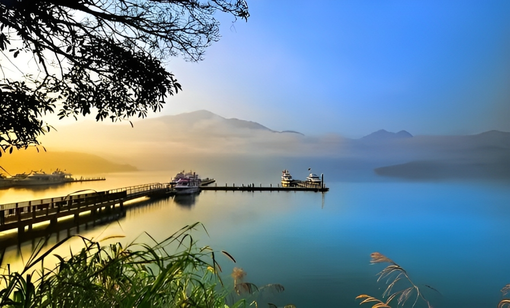
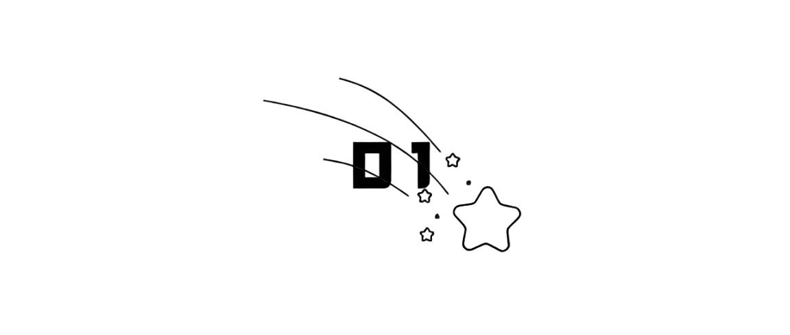
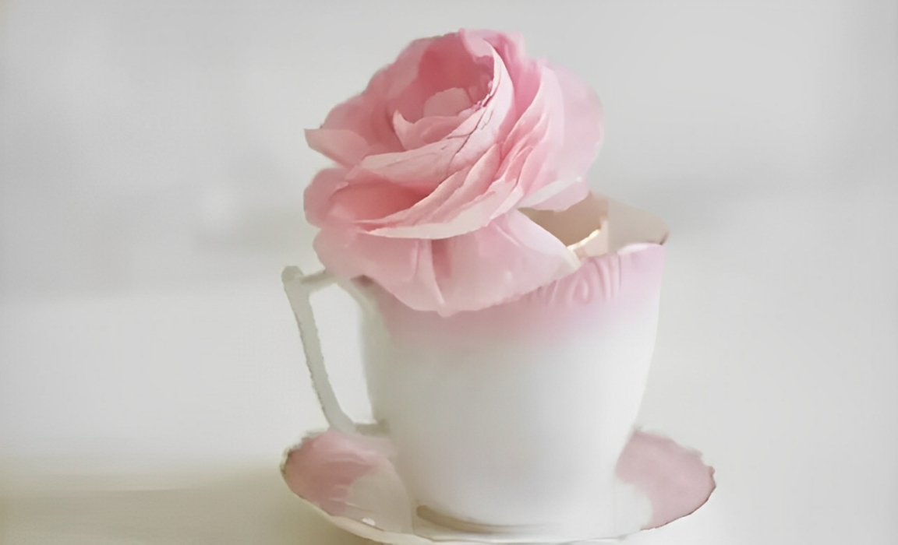
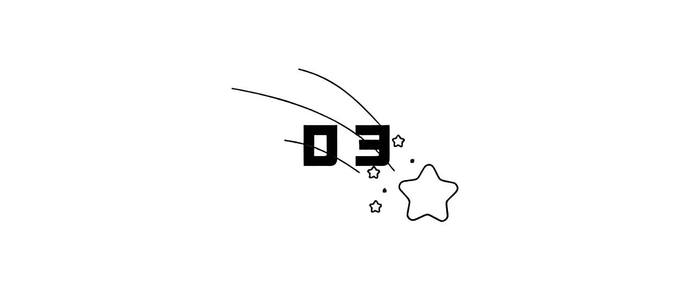
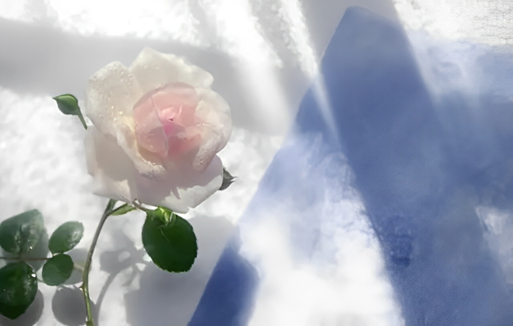

《心存旷野，手握玫瑰》这本书中有这样一句话：

**“有随它去的心态又有克制自我的能力，才是与世界长久相处的好方法。”**

在凡尘中修行，在安静中修心。

一个人最好的状态，就是好好生活，不胡思乱想。

  
  <h3>做事努力</h3>

没有压力的船最危险，没有负重的人生最可怕。

18世纪英国著名的航海家詹姆斯·库克，45岁的时候第二次远征太平洋。

当他的航海船队返航时，遇上了可怕的风暴。

库克和船员们所在的空货轮摇摇晃晃，眼看就要被风浪吞没。

此时，库克下命令，“立即打开货舱，灌满船舱三分之一的海水！”

船员们都以为他疯了，但是库克坚持要这么做。

事实上，当海水灌到货舱三分之一的刻度时，虽然海面上依然狂风大作，货船却奇迹般地恢复了平稳。

海上风暴大，被打翻的往往是根基轻的小船，上万吨的巨轮很少有被打翻的。

人生也是如此，如果只图轻松，不努力做事，就很容易被命运打败。

有时候，我们看见的是麻烦，但常常忘记，正是这些麻烦，让我们成长，使人生丰富。

捷克作家米兰·昆德拉曾说：“一切重压与负担，人都可以承受，它会使人坦荡而充实地活着，最不能承受的恰恰是‘轻松’。”

努力做事，负重前行，不虚度年华，才不负此生。

  
  <h3>心态稳定</h3>

看一个人是不是有成绩，不是看他做了什么，而是以怎样的心态去做。

《六祖坛经》中记载了这样一则故事：

梁武帝爱佛法，一次，梁武帝问六祖达摩：“我即位以来，弘扬佛法，建寺庙，抄佛经，这功德应该不小了吧？”

谁知达摩却说：“没有功德。”

梁武帝不解，问为什么没有功德？

达摩说：“因为你的一切仅仅是为了取得功德。”

做事，是为了让自己感觉心安。

不能以得到和失去，或者收获多寡，来评价。

得到，欢喜；失去，亦欢喜。

行路，是一种体验；做人，是一种境界。

认真做事，开阔心胸，放下得失，人生才得真正的自由。

  
  <h3>不忘初心，方得始终</h3>

看过一句话：

“无休止地自设困境，带来的是无休止地自我折磨。”

人世间最大的牢笼，不是监狱，而是心的绝境。

无论遇到什么境遇，活到什么年纪，都不应该放弃努力成长。

听过这样一则故事：

有个武术大师，因为一次意外，腿摔断了。

因为这个武术大师，擅长的就是腿上的功夫，可是现在却没了腿，所以弟子们都替他悲伤。

然而，事实并没有按人们通常的理解发展。

当武术大师，从昏迷中醒来的时候，并没有为自己失去的双腿忧伤。

他只是一如往昔，继续认真练武，只是这次他练习的是臂掌部的功夫。

他告诉弟子：

“我不会因为没有了两条腿而变成废人，你们也不必因为我而放弃自己的修炼。”

不因失去的而悔恨，只对拥有的去珍惜。

命运残酷的给人以磨难，不忘初心，不断精进，却是我们对生命最好的回答。

结语：

曾经有个学生心浮气躁，总是无法专心学习，于是他向老师求教。

老师对他说了一段话：

“人生最重要的，就是不要去看远方模糊的未来，而是动手清理手边实实在在的最具体的事情。”

一个人最好的状态，就是不急不躁，认真做事。把未来交给时间，把心安放当下。

—END—